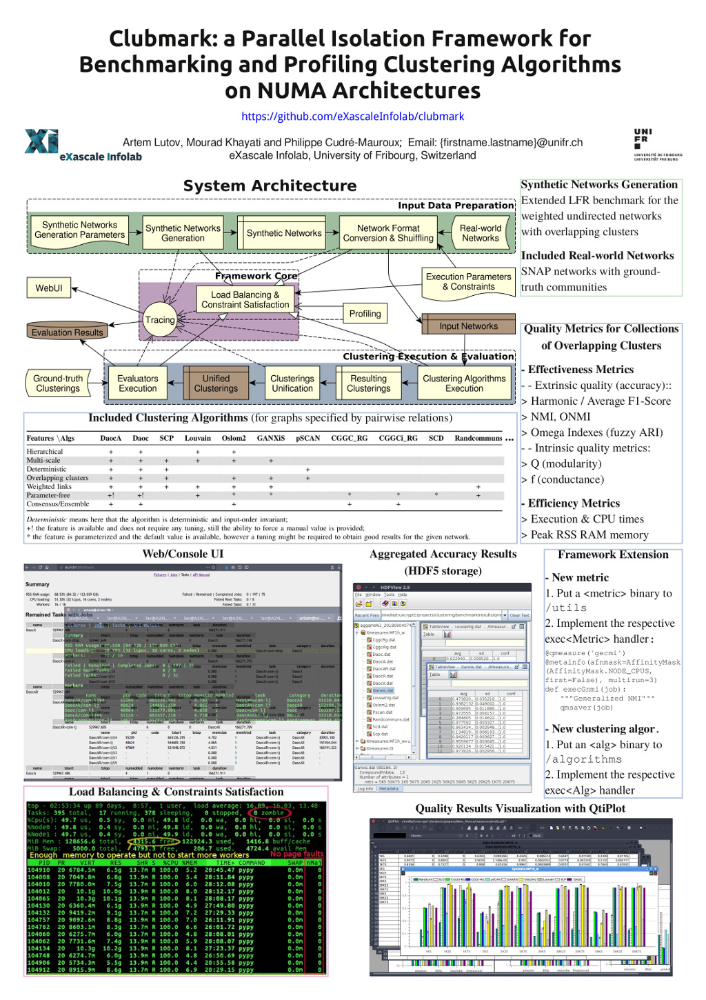

# Clubmark (former [PyCABeM](https://github.com/eXascaleInfolab/PyCABeM/tree/draft)) - Bench  marking Framework for the Clustering Algorithms Evaluation

`\brief` Benchmarking and real-time profiling of the \[overlapping\] clustering (community detection) algorithms, evaluating their quality using extrinsic (all existing accuracy measures applicable for overlapping clustering algorithms on large datasets: Mean [F1 Score](https://en.wikipedia.org/wiki/F1_score) family, Normalized [Mutual Information](https://en.wikipedia.org/wiki/Mutual_information)(NMI) and [Omega Index](https://www.ncbi.nlm.nih.gov/pubmed/26764947) / fuzzy ARI family) and intrinsic ([Modularity](https://en.wikipedia.org/wiki/Modularity_(networks))(Q) and [Conductance](https://en.wikipedia.org/wiki/Conductance_(graph))(f)) measures considering overlaps/covers (shared node membership by multiple clusters \[on the same resolution level\]) and multiple resolutions (the same node can be a full member of a cluster and its super-clusters).  
`\authors` (c) Artem Lutov <artem@exascale.info>  
`\organizations` [eXascale Infolab](http://exascale.info/), [Lumais](http://www.lumais.com/), [ScienceWise](http://sciencewise.info/)  
`\keywords` overlapping clustering benchmarking, community detection benchmarking, algorithms benchmarking framework.

`\cite` [Clubmark: a Parallel Isolation Framework for Benchmarking and Profiling Clustering Algorithms on NUMA Architectures](https://github.com/eXascaleInfolab/clubmark/blob/draft/docs/clubmark.pdf)
```bibtex
@inproceedings{Clb18,
	author={Artem Lutov and Mourad Khayati and Philippe Cudr{\'e}-Mauroux},
	title={Clubmark: a Parallel Isolation Framework for Benchmarking and Profiling Clustering Algorithms on NUMA Architectures},
	booktitle={2018 IEEE International Conference on Data Mining Workshops (ICDMW)},
	year={2018},
	keywords={benchmarking framework, clustering evaluation, parallel benchmarking, algorithm profiling, community detection benchmarking, constraint-aware load-balancing}
}
```

## Content
- [Brief Tutorial](#fast-start)
- [Overview](#overview)
- [Motivation](#motivation)
- [Requirements](#requirements)
  - [Prerequisites](#prerequisites)
  - [Deployment via Docker](#deployment-via-docker)
  - [Direct Deployment](#direct-deployment)
- [Usage](#usage)
- [Benchmark Structure](#benchmark-structure)
- [Benchmark Extension](#benchmark-extension)
- [Related Projects](#related-projects)


## Brief Tutorial
On Linux Ubuntu 16.04 LTS x64:
1. Clone this repository: `$ git clone https://github.com/eXascaleInfolab/clubmark.git`
2. Install dependencies: `$ install_reqs.sh`
3. Prepare system environment for the load balancer: `$ prepare_hostenv.sh`
4. Run the benchmark from the cloned repository: `$ python3 ./benchmark.py -w=0.0.0.0:8080 -g=3%3 -i%3=realnets/*.nse -a="CggciRg Daoc DaocAR DaocX LouvainIg Pscan Scd CggcRg DaocA DaocR Ganxis Oslom2 Randcommuns Scp" -q="Xmeasures -fh -o -s" -s -t=8h --runtimeout=15d 1>> ./bench.log 2>> ./bench.err`
    - `-w=0.0.0.0:8080`  - deploy profiling Web UI at `0.0.0.0:8080`
    - `-g=4%3`  - generate 4 instances of each kind of the synthetic network (weighted undirected graph with overlapping clusters in the ground-truth) and additionally shuffle (reorder links and nodes of) each instance 3 times
    - `-i%3=realnets/*.nse`  - additionally process \[real-world\] networks from `./realnets` (the networks should be put there in advance, see `./prepare_snapdata.sh`)
    - `-a=...`  - execute specified clustering algorithms, produces sets (hierarchy / multiple levels of) clusters and execution profiles in `./results/<algname>`
    - `-q=...`  - evaluate produced clusters with the specified quality measures, produces (raw) evaluation results in `./results/qmeasures/qmeasures_*.h5`
    - `-s`  - aggregate and summarize the quality evaluation results, produces `./results/qmeasures/aggqms_*.h5` from `./results/qmeasures/qmeasures_*.h5`
    - `-t=8h`  - limit execution time for each algorithm / evaluation measure on each dataset to 8 hours
    - `--runtimeout=15d`  - limit execution time for the whole benchmarking to 15 days
    - `1>> ...` output execution log (`stdout` tracing) to the `./bench.log`
    - `2>> ...` output execution log (`stderr` tracing) to the `./bench.err`

To run the benchmark on other [POSIX-compatible] platfroms / operating systems, either the [docker container](#deployment-via-docker) of the default environment should be used, or all clustering algorithms and evaluating measures should be recompiled for the target platform.

## Overview

The benchmark executes specified applications (clustering algorithms) on the specified or generated input datasets (networks), measures execution statistics and evaluates accuracy of the results using specified measures. Clubmark is a general-purpose modular benchmarking framework specialized for the clustering (community detection) algorithms evaluation. The generic functionality is based on [PyExPool](https://github.com/eXascaleInfolab/PyExPool) multiprocess execution pool and load balancer.

Generic properties:
- Data preprocessing (synthetic networks generation, shuffling, etc.);
- Pre/post execution callbacks for each executable to perform the application specific initialization and finalization (results normalization, logs post-processing, etc.);
- Execution of the specified applications on the specified input datasets;
- Resource consumption management and tracing:
  * Specification of the global and per executable constraints for the maximal execution time and memory consumption;
  * Binding of any executable to the specified set of logical CPUs (affinity masking) to employ advantages of the NUMA hardware executing apps in parallel not affecting their CPU caches (dedicating L1/2/3 caches);
  * Tracing of the execution time, CPU timings (user and kernel) and peak RAM RSS memory consumption;
- Load balancing of the executing apps to employ as much as possible available hardware resources respecting the specified constraints;
- Resilience and fault tolerance (failover execution), where crashes of some running applications does not affect execution of other applications and other scheduled jobs associated with the crashed application.

Properties specific for the clustering algorithms benchmarking:
- Synthetic networks generation with the extended [LFR Framework](https://github.com/eXascaleInfolab/LFR-Benchmark_UndirWeightOvp) and subsequent shuffling;
- Execution of the [clustering algorithms](algorithms/README.md) on the specified networks;
- Evaluation of the extrinsic (modularity, conductance) and intrinsic (various NMIs and F1-Scores) quality measures for the generalized clustering algorithms (considering overlaps and multiple resolutions/scales if any);
- Selection of the best result for the parameterized clustering algorithms among the results produced for the specified variations of the parameters;
- Evaluation of both the average value and deviation of [the quality measures](utils/README.md#clustering-quality-measures). The deviation is evaluated if multiple instances and/or shuffles (nodes and links reordering) of the input networks are present.

Executing [algorithms](algorithms/README.md) and [evaluation measures with the accessory processing tools](utils/README.md) are described on the respective pages.

Clubmark Demo Poster for ICDM18:


## Motivation

I have not found any open source cross-platform framework for the [efficient] execution and evaluation of custom applications, which have  significant variation of the time/memory complexity and custom constraints, so decided to write the own one.

Particularly, I had to evaluate various clustering (community detection) algorithms on large networks using specific measures. The main challenges are the following:
- the executing applications (clustering algorithms) being benchmarked have very different (orders of magnitude) time and memory complexity and represented by the applications implemented on various languages (mainly C++, Java, C and Python);
- the target datasets are very different by structure and size (orders of magnitude varying from KBs to GBs);
- the accessory evaluating applications (NMI, F1 Scores, ...) have very different (orders of magnitude) time and memory complexity and architecture (single-threaded and multi-threaded applications).

Ideally, the applications should be executed in parallel in a way to guarantee that they:
- are not swapped out from RAM (which happens on the *unconstrained* execution of multiple memory demanding apps) to not affect the efficiency measurements;
- consume as much available hardware resources as possible to speedup the benchmarking;
- localize the CPU cache (the processes are not jumped between the CPUs and work with the hot cache);
- are automatically terminated from the execution on more complex datasets if do not satisfy the execution constraints on lighter datasets.

Before starting Clubmark development I found several open source frameworks for the "Community Detection Algorithms" evaluation but they do not fulfill the outlined constraints. The most comprehensive one is [Circulo](http://www.lab41.org/circulo-a-community-detection-evaluation-framework/) from [Lab41](https://github.com/Lab41/Circulo/tree/master/experiments), another one is called [CommunityEvaluation](https://github.com/rabbanyk/CommunityEvaluation).  
Circulo is an excellent framework until you don't run evaluations on the large networks, don't need to specify per-algorithm time/memory constraints and in case the default pipeline is sufficient, which was not the case for me.


## Requirements

The benchmarking can be run either directly on the *Linux Ubuntu 16.04 x64* or via the [Docker](https://docs.docker.com/get-started/) container with the pre-installed environment on any platform. Anyway, the sources are required:
```sh
$ git clone https://github.com/eXascaleInfolab/clubmark.git 
```


### Prerequisites

The benchmarking framework itself is a *cross-platform* application implemented on Python, and works at least on CPython 2/3 and Pypy interpreters.
However, the benchmark executes clustering algorithms and evaluation utilities built for the specific platform. The build is performed for the *Linux Ubuntu 16.04 x64*, on other NIX systems some requirements might be missed and not easily solvable. [Docker](https://docs.docker.com/get-started/) image is prepared to run the benchmark from the docker container on any other platform without any issues.

> [Windows 10+ x64 provides Ubuntu-compatible bash shell](https://www.howtogeek.com/249966/how-to-install-and-use-the-linux-bash-shell-on-windows-10/), which allows to install and execute terminal Ubuntu apps and execute the benchmarking like on Linux Ubuntu 16.04 x64.

The subsequent steps are described for the *NIX* platforms including MaxOS.  
To be sure that the operational system allows to work with lots of opened files and has adequate swapping policy, execute:
```sh
$ . ./prepare_hostenv.sh
```
> * The leading `.` or `source` is *required* to execute the script in the current shell environment instead of the new process.
> * This script should be executed **on the host system event if the benchmark is executed from the docker container** because the container shares resources of the host system (kernel, memory and swap). The made changes will be reseted after the restart.

Alternatively, the operational system environment can be updated permanently.

- The max number of the opened files in the system `$ sysctl fs.file-max` should be large enough, the recommended value is `1048576`.
- The max number of the opened files per a process`$ ulimit -n` should be at least `4096`, the recommended value is `65536`.

To setup `fs.file-max` permanently in the system add the following line to the `/etc/sysctl.conf`:
```sh
fs.file-max = 1048576
```
and then reload it with `# sysctl -p`.  
To setup the `ulimit` permanently add the following lines to the `/etc/security/limits.conf`:
```sh
*               hard    nofile          524288
*               soft    nofile          32768  
```
And then execute `ulimit -n 32768` to set this value for the current shell.

> `ulimit` can't be set higher than the hard limit `ulimit -Hn`, so if the latter < `32768` then execute:
```sh
$ ulimit -n `ulimit -Hn`
```

Reduce the system `swappiness` setting to `1..10` by `$ sudo sysctl -w vm.swappiness=5` or set it permanently in `/etc/sysctl.conf`:
```sh
vm.swappiness = 5
``` 


### Deployment via Docker

> This section is optional if your host OS is *Linux Ubuntu 16.04 x64*, which makes possible to run the benchmarking directly.

The *Docker* can be installed on the Linux Ubuntu 16.04 executing:
```sh
$ sudo apt-get update && apt-get upgrade
$ sudo apt-get install -y docker.io
```
To install the Docker on any other platform refer the [official installation instructions](https://docs.docker.com/engine/installation/).

> It is recommended to use `overlay2` storage driver on any OS, see details in the [official documentation](https://docs.docker.com/engine/userguide/storagedriver/overlayfs-driver/#configure-docker-with-the-overlay-or-overlay2-storage-driver). `overlay2` requires Linux kernel v4.x, which can be updated from 3.x to 4.x on Red Hat / CentOS 7 / Scientific Linux as described in [this article](https://www.tecmint.com/install-upgrade-kernel-version-in-centos-7/).

Add your user to the docker group to use it without `sudo`:
```sh
$ sudo groupadd docker
$ sudo usermod -aG docker $USER
```
Log out and log in back so that your group membership is re-evaluated, or execute:
```sh
$ su - $USER
```
> Optionally, configure Docker to start on boot:
> ```sh
> $ sudo systemctl enable docker
> ```
> and check other [docker post-installation](https://docs.docker.com/engine/installation/linux/linux-postinstall/) steps.

Start Docker service:
```sh
$ sudo systemctl start docker
$ docker version
```
See also the [brief tutorial on Docker installation and usage](https://www.howtoforge.com/tutorial/docker-installation-and-usage-on-ubuntu-16.04/) or the [official getting started tutorial](https://docs.docker.com/get-started/).

> Optionally, the `clubmark` docker image containing the execution environment can be built from the source [Dockerfile](Dockerfile) by executing from the repository directory:
> ```sh
> $ docker build -t luaxi/clubmark-env:v3.0-U16.04 -t luaxi/clubmark-env .
> ```
The prebuilt image will be automatically pulled from the *Docker Hub* repository on first docker `run` if it has not been built locally.

To **run the benchmark** you can either execute:
```sh
$ docker run -it -u $UID -v `pwd`:/opt/clubmark luaxi/clubmark-env:v3.0-U16.04 [<clubmark_args>]
```
which calls `./benchmark.py [<clubmark_args>]`, or open a shell in the benchmarking directory:
```sh
$ docker run -it --entrypoint "" -u $UID -v `pwd`:/opt/clubmark luaxi/clubmark-env:v3.0-U16.04
```
and call `./benchmark.py` with the required parameters there.
> $UID might not be defined in the non-bash shell (sh, etc), then use `id -u $USER` instead.  
`` `pwd` `` projects to `<CLUBMARK_REPOSITORY_PATH>`, which is the current directory and the working directory of the benchmarking.  
`/opt/clubmark` or any other local directory denotes th e directory in the CONTAINER where the benchmarking results and traces are stored, which is mapped to the current host directory (`` `pwd` ``).  
See also [Docker cheat sheet](https://coderwall.com/p/2es5jw/docker-cheat-sheet-with-examples).

See the [Usage](#usage) section to learn more about the benchmark execution and results structure.

### Direct Deployment

> This section should be omitted if the benchmarking is run on the docker container.

The target environment is *Linux Ubuntu 16.04 x64*. To install all the requirements locally, execute from the Clubmark repository directory:
```sh
$ ./install_reqs.sh
```
See [install_reqs.sh](install_reqs.sh) and [pyreqs.txt](pyreqs.txt) for the details about the installing packages.

> The benchmarking framework can be executed under Python 2.7+/3.x and verified on CPython and [PyPy](http://pypy.org/) JIT.  
Some executing algorithms support only Python2 / pypy, others both Python3 and Python2. The appropriate interpreter for each executable is automatically selected in the runtime. The recommended environment, which is installed by the script is both Python3 and pypy.  
> See also dependencies of the [utilities](utils/README.md#requirements), which are installed automatically.


## Usage

There are two main scripts to execute the benchmark:
- `./benchmark.py` to run the benchmark in the terminal (interactive mode)
- `./benchmark_daemon.sh` to run the benchmark on the background (daemon mode)
> Note: Execution of the benchmark has been verified only on Linux Ubuntu 16.04 x64, but it should work on any platform where the dependences are satisfied.

The benchmark executes specified applications on the specified datasets in interactive or daemon mode logging the resources consumption, algorithms output and exceptions, and performing the workflow management (termination by timeout, resistance to exceptions, etc.) and results aggregation. All results and logs are stored even in case of the internal (crash) or external termination of the benchmarking applications or the whole framework itself.

<!-- #region BenchParams -->
To see the possible input parameters, run the benchmark without the arguments or with `-h`: `$ ./benchmark.py`:
```sh
$ ./benchmark.py 
Usage:
  ./benchmark.py [-g[o][a]=[<number>][%<shuffles_number>][=<outpdir>] [-i[f][a][%<shuffles_number>]=<datasets_{dir,file}_wildcard> [-c[f][r]] [-a=[-]"app1 app2 ..."] [-r] [-q[="qmapp [arg1 arg2 ...]"]] [-s=<resval_path>] [-t[{s,m,h}]=<timeout>] [-d=<seed_file>] [-w=<webui_addr>] | -h

Example:
  ./benchmark.py -g=3%5 -r -q -th=2.5 1> results/bench.log 2> results/bench.err
NOTE:
  - The benchmark should be executed exclusively from the current directory (./).
  - The expected format of input datasets (networks) is .ns<l> - network specified by <links> (arcs / edges), a generalization of the .snap, .ncol and Edge/Arcs Graph formats.
  - Paths can contain wildcards: *, ?, +.
  - Multiple paths can be specified with multiple -i, -s options (one per the item).

Parameters:
  --help, -h  - show this usage description
  --generate, -g[o][a]=[<number>][%<shuffles_number>][=<outpdir>]  - generate <number> synthetic datasets of the required format in the <outpdir> (default: syntnets/), shuffling (randomly reordering network links and saving under another name) each dataset <shuffles_number> times (default: 0). If <number> is omitted or set to 0 then ONLY shuffling of <outpdir>/networks//* is performed. The generated networks are automatically added to the begin of the input datasets.
    o  - overwrite existing network instances (old data is backed up) instead of skipping generation
    a  - generate networks specified by arcs (directed) instead of edges (undirected)
NOTE: shuffled datasets have the following naming format:
	<base_name>[(seppars)<param1>...][^<instance_index>][%<shuffle_index>].<net_extension>
  --input, -i[f][a][%<shuffles_number>]=<datasets_dir>  - input dataset(s), wildcards of files or directories, which are shuffled <shuffles_number> times. Directories should contain datasets of the respective extension (.ns{e,a}). Default: -i=syntnets/networks/*/, which are subdirs of the synthetic networks dir without shuffling.
    f  - make flat derivatives on shuffling instead of generating the dedicated directory (having the file base name) for each input network, might cause flooding of the base directory. Existed shuffles are backed up.
    NOTE: variance over the shuffles of each network instance is evaluated only for the non-flat structure.
    a  - the dataset is specified by arcs (asymmetric, directed links) instead of edges (undirected links), considered only for not .ns{a,e} extensions.
NOTE:
  - The following symbols in the path name have specific semantic and processed respectively: ('!', '^', '%', '#').
  - Paths may contain wildcards: *, ?, +.
  - Multiple directories and files wildcards can be specified with multiple -i options.
  - Existent shuffles are backed up if reduced, the existend shuffles are RETAINED and only the additional shuffles are generated if required.
  - Datasets should have the .ns<l> format: <node_src> <node_dest> [<weight>]
  - Ambiguity of links weight resolution in case of duplicates (or edges specified in both directions) is up to the clustering algorithm.
  --apps, -a[=[-]"app1 app2 ..."]  - apps (clustering algorithms) to be applied, default: all.
Leading "-" means apply all except the specified apps. Available apps (24): CggcRg, CggciRg, Daoc, DaocA, DaocAR, DaocARB, DaocARB1, DaocARB5, DaocB, DaocB1, DaocB5, DaocR, DaocRB, DaocRB1, DaocRB5, DaocRBX, DaocX, Ganxis, LouvainIg, Oslom2, Pscan, Randcommuns, Scd, Scp.
Impacts {r, q} options. Optional, all registered apps (see benchapps.py) are executed by default.
NOTE: output results are stored in the "results/<algname>/" directory
  --runapps, -r  - run specified apps on the specified datasets, default: all
  --quality, -q[="qmapp [arg1 arg2 ...]"  - evaluate quality (accuracy) with the specified quality measure application (<qmapp>) for the algorithms (specified with "-a") on the datasets (specified with "-i") and form the aggregated final results. Default: MF1p, GNMI_max, OIx extrinsic and Q, f intrinsic measures on all datasets. Available qmapps (4): Gnmi, Imeasures, Onmi, Xmeasures.
NOTE: Multiple quality measure applications can be specified with multiple -q options.
Notations of the quality mesurements:
 = Extrinsic Quality (Accuracy) Measures =
   - GNMI[_{max,sqrt}]  - Generalized Normalized Mutual Information for overlapping and multi-resolution clusterings (collections of clusters), equals to the standard NMI when applied to the non-overlapping single-resolution clusterings.
   - MF1{p,h,a}[_{w,u,c}]  - mean F1 measure (harmonic or average) of all local best matches by the Partial Probabilities or F1 (harmonic mean) considering macro/micro/combined weighting.
   - OI[x]  - [x - extended] Omega Index for the overlapping clusterings, non-extended version equals to the Adjusted Rand Index when applied to the non-overlapping single-resolution clusterings.
 --- Less Indicative Extrinsic Quality Measures ---
   - F1{p,h}_[{w,u}]  - perform labelling of the evaluating clusters with the specified ground-truth and evaluate F1-measure of the labeled clusters
   - ONMI[_{max,sqrt,avg,lfk}]  - Ovelapping NMI suitable for a single-resolution clusterins having light overlaps, the resulting values are not compatible with the standard NMI when applied to the non-overlapping clsuters.
 = Intrinsic Quality Measures =
   - Cdt  - conducance f for the overlapping clustering.
   - Q[a]  - [autoscaled] modularity for the overlapping clustering, non-autoscaled equals to the standard modularity
 when applied to the non-overlapping single-resolution clustering.
  --timeout, -t=[<days:int>d][<hours:int>h][<minutes:int>m][<seconds:float>] | -t[X]=<float>  - timeout for each benchmarking application per single evaluation on each network; 0 - no timeout, default: 1d12h. X option:
    s  - time in seconds, default option
    m  - time in minutes
    h  - time in hours
    Examples: `-th=2.5` is the same as `-t=2h30m` and `--timeout=2h1800`
  --seedfile, -d=<seed_file>  - seed file to be used/created for the synthetic networks generation and stochastic algorithms, contains uint64_t value. Default: results/seed.txt
NOTE: the seed file is not used in the shuffling, so the shuffles are distinct for the same seed.

Advanced parameters:
  --convret, -c[X]  - convert input networks into the required formats (app-specific formats: .rcg[.hig], .lig, etc.), deprecated
    f  - force the conversion even when the data is already exist
    r  - resolve (remove) duplicated links on conversion (recommended to be used)
  --summary, -s=<resval_path>  - aggregate and summarize specified evaluations extending the benchmarking results, which is useful to include external manual evaluations into the final summarized results
ATTENTION: <resval_path> should include the algorithm name and target measure.
  --webaddr, -w  - run WebUI on the specified <webui_addr> in the format <host>[:<port>], default port=8080.
  --runtimeout  - global clustrering algorithms execution timeout in the format [<days>d][<hours>h][<minutes>m<seconds>], default: 10d.
  --evaltimeout  - global clustrering algorithms execution timeout in the format [<days>d][<hours>h][<minutes>m<seconds>], default: 2d.
```
<!-- #endregion BenchParams -->
> _REPRODUCIBILITY NOTICE_: Use seed to reproduce the evaluations but be aware that:
> - the seed is not applicable for the shuffling (reordering of the network nodes and links, which is truly random) and
> - not all clustering algorithms might support the seed.
So, in case of shuffling, the original shuffles should be provided to reproduce exactly the same results for the deterministic algorithms.

It is possible to have multiple input directories with similarly named files inside, which represent different instances / snapshots of the datasets. In such case, the results are produced per each snapshot, plus aggregated weighted average over all snapshots. This is useful to avoid occasional bias to the specific instance or to analyze evolving networks.  
If any application is crashed, the crash is logged and does not affect execution of the remaining applications. The benchmark can be terminated by the timeout or manually.
*automatic extension / back up* of the already existent results to the timestamped .gzip archives on the benchmarking re-execution.
*logging of traces (stdout) and errors (stderr)* (outputs of the executables and their runtime statistics) for each executable and for the benchmarking framework itself;


### Synthetic networks generation, clustering algorithms execution and evaluation
To speed up generation of the synthetic networks, run the benchmarking under the PyPy:
```sh
$ pypy ./benchmark.py -g=3%2=syntnets_i3_s4 -a="scp oslom2" -r -q -tm=90
```
This command generates synthetic networks producing 3 instances of each network with 2 shuffles (random reordering of network nodes) of each instance yielding 3*2=6 synthetic networks of each type (for each set of the network generation parameters). The generated networks are stored in the specified `./syntnets_i3_s4/` directory.  
`scp` and `oslom2` clustering algorithms are executed for each generated network, default quality measures are evaluated for these algorithms with subsequent aggregation of the results over all instances and shuffles of each network.  
The timeout is set to 90 min for the following actions: networks generation and then for each network a) clustering and b) evaluation by each specified measure. The network here is each shuffle of each instance of each network type.


### Shuffling of the existent networks, clustering algorithm  execution and evaluation
```sh
$ pypy ./benchmark.py -ie%5='realnets' -cr -a="daoc" -r -qenx -th=1
```
This command makes 5 shuffles for each network in the `./realnets/` directory (already existent shuffles of this network are backed up), converts networks to the .rcg format, executes `daoc` algorithm for all shuffles and evaluates `NMI_max` with timeout for each activity equal to 1 hour.

> Already existent shuffles / clusterings / evaluations are backed up to the timestamped `.gzip` archive.


### Aggregation of the specified evaluation results
```sh
$ pypy benchmark.py -s=results/scp/mod/*.mod
```
Results aggregation is performed with automatic identification of the target clustering algorithm and evaluation measure by the specified path. It is performed automatically as the last step of the algorithm evaluation, but also can be called manually for the modified scope.


## Benchmark Structure

- ./contrib/  - valuable patches to the external open source tools used as binaries
- ./algorithms/  - benchmarking algorithms
- ./results/  - aggregated and per-algorithm execution and evaluation results (brief `*.res` and extended `*.resx`): timings (execution and CPU), memory consumption, NMIs, Q, per-algorithm resources consumption profile (`*.rcp`)
  - `<algname>.rcp`  - resource consumption profile for all executions of the algorithm even in case of crashes / interruptions
  - `<measure>.res[x]`  - aggregated value of the measure: average is evaluated for each level / scale for all shuffles of the each network instance, then the weighted best average among all levels is taken for all instances as a final result
  * `<algname>/clusters/`  - algorithm execution results produced hierarchies of communities for each network instance shuffle
    - `*.cnl`  - resulting clusters unwrapped to nodes (community nodes list) for NMIs evaluation. `*.cnl` are generated either per each level of the resulting hierarchy of communities or for the whole hierarchy (parameterized inside the benchmark)
  * `<algname>/<measure>/`  - evalautions of the `<measure>` of the `<algname>` for each level (if the clustering is hierarchical or multi-level) of the network instance, were `measure = {mod, nmi, f1h, f1p, ...}`
    - `<net_instance>.<mext>`  - `<measure>` value aggregated per all network instances and shuffles
  - `*.log`  - `stdout` of the executed algorithm, logs
  - `*.err`  - `stderr` of the executed algorithm and benchmarking routings, errors

Example of the `<entity>.rcp` format:
```sh
# ExecTime(sec)	CPU_time(sec)	CPU_usr(sec)	CPU_kern(sec)	RSS_RAM_peak(Mb)	TaskName
2.575555	2.574302	2.540420	0.033882	6.082	5K5
0.528582	0.528704	0.519277	0.009427	3.711	2K10
...
```

Example of the `.res` format:
```sh
# --- 2015-12-31 16:15:37.693514, output:  Q_avg
# <network>	ganxis	louvain_igraph	...
karate	0.130950	0.414481	0.233974	0.240929
jazz_u	0.330844	0.400587	0.392081	0.292395
...
```

Example of the `.resx` format:
```sh
# --- 2015-12-31 17:05:50.582245 ---
# <network>
#	<alg1_outp>
#	<alg2_outp>
#	...
karate
  ganxis>	Q: 0.130950 (0.084073 .. 0.217867), s: 0.163688, count: 5, fails: 0, d(shuf): 0.133794, s(shuf): 0.0566965, count(shuf): 5, fails(shuf): 0
  louvain_igraph>	Q: 0.414481 (0.395217 .. 0.419790), s: 0.518101, count: 5, fails: 0, d(shuf): 0.024573, s(shuf): 0.0120524, count(shuf): 5, fails(shuf): 0
  ...
jazz_u
  ganxis>	Q: 0.340728 (0.321374 .. 0.371617), s: 0.42591, count: 5, fails: 0, d(shuf): 0.050243, s(shuf): 0.0219596, count(shuf): 5, fails(shuf): 0
  louvain_igraph>	Q: 0.400587 (0.399932 .. 0.400999), s: 0.534116, count: 4, fails: 0, d(shuf): 0.001067, s(shuf): 0.000595067, count(shuf): 4, fails(shuf): 0
  ...
...
```

Example of the `<net_instance>.nmi[_s]` format:
```sh
# NMI	level[/shuffle]
0.815814	0
0.870791	1
0.882737	0/1
...
```

Example of the `<net_instance>.mod` format:
```sh
# Q	level[/shuffle]
0.333874	1
0.32539	0
0.313085	0/1
...
```

- ./realnets/  - simple gold standard networks with available ground-truth
  - dimacs/  - [10th DIMACS'13](http://www.cc.gatech.edu/dimacs10/) networks with the ground-truth modularity value for non-overlapping clustering (see "Modularity Maximization in Networks by Variable Neighborhood Search" by Daniel Aloise et al, 10th DIMACS'13)
  - snap/  - Stanford SNAP large networks with available ground-truth communities (see "Defining and Evaluating Network Communities based on Ground-truth" by J. Yang and J. Leskovec, ICDM'12)
- ./syntnets/  - synthetic networks produced by the extended LFR framework: undirected weighted complex networks with overlaps, both mixing parameters are set for the topology and weights, both exponential nodes degree and weights distributions are set
  * `*.ngp`  - network generation parameters
  * `time_seed.dat`  - used time seed on batch generation
  * `*.ngs`  - time seed for the network (**n**etwork **g**eneration **s**eed)
  * `*.nst`  - statistics for the generated network (**n**etwork **st**atistics)
  * `*.nsa`  - generated network to be processed as input graph by the algorithms to build the community structure. The **n**etwork is specified by newline / space/tab **s**eparated **a**rcs as a list of lines: `<src_id> <dst_id> [<weight>]`
  * `*.cnl`  - ground truth for the community structure (cluster/**c**ommunity **n**odes **l**ist) generated by the LFR framework. It is specified by the space/tab separated nodes for each cluster (a line in the file): `<c1_nid_1> <c1_nid_2> ...`
- `./exectime`  - lightweight resource consumption [profiler](https://bitbucket.org/lumais/exectime/)
- `./benchmark.py`  - the benchmark (interactive mode)
- `./benchmark_daemon.sh`  - the shell script to execute the benchmark in background (daemon mode)
- `./install_depends.sh`  - the shell script to install dependencies

Structure of the generating synthetic networks:
```sh
<syntnets>/
  lastseed.txt
  seeds/
    <netname>.ngs
  params/
    <netname>.ngp
  networks/
    <netname>/
      <netname>^<instid>.{cnl,nse, nst}
      <netname>^<instid>/  # Optional, exists only when the shuffling is performed
        <netname>^<instid>.nse  # Hardlink
        <netname>^<instid>%<shufid>.nse
```
where `<instid>` is id of the synthetic network instance with the fixed parameters and `<shufid>` is id of the shuffle of the instance.

Expected structure of the input real-world networks with generating shuffles:
```sh
<realnets>/
    <netname>.{cnl, nse}
    <netname>/  # Optional, exists only when the shuffling is performed
        <netname>.nse  # Hardlink
        <netname>%<shufid>.nse
```

## Benchmark Extension
To add custom apps / algorithms to be benchmarked just add corresponding function for "myalgorithm" app to `benchapps.py`:

```python
def execMyalgorithm(execpool, netfile, asym, odir, timeout, seed=None, task=None, pathidsuf='', workdir=ALGSDIR)
  """Execute the algorithm (stub)

  execpool: ExecPool  - execution pool of worker processes
  netfile: str  - the input network to be clustered
  asym: bool  - whether the input network is asymmetric (directed, specified by arcs)
  odir: bool  - whether to output results to the dedicated dir named by the network instance name,
    which is actual for the shuffles with non-flat structure
  timeout: ufloat32  - processing (clustering) timeout of the input file, 0 means infinity
  seed: uint64 or None  - random seed, uint64_t
  task: Task  - owner task
  pathidsuf: str  - network path id prepended with the path separator
  workdir: str  - relative working directory of the app, actual when the app contains libs

  return  njobs: uint  - number of performed executions (started jobs)
  """
```

All the evaluations will be performed automatically, the algorithm should just follow conversion of the execution results output.


## Related Projects
* [PyExPool](https://github.com/eXascaleInfolab/PyExPool)  - multiprocess execution pool and load balancer, which provides [external] applications scheduling for the in-RAM execution on NUMA architecture with capabilities of the affinity control, CPU cache vs parallelization maximization, memory consumption and execution time constrains specification for the whole execution pool and per each executor process (called worker, executes a job).
* DAOC - (former [HiReCS](https://github.com/eXascaleInfolab/hirecs) High Resolution Hierarchical Clustering with Stable State, which was totally redesigned).

See also [eXascale Infolab](https://github.com/eXascaleInfolab) GitHub repository and [our website](http://exascale.info/) where you can find another projects and research papers related to Big Data processing!  
**Note:** Please, [star this project](https://github.com/eXascaleInfolab/clubmark) if you use it. 

<!--
## HDF5 File Format
The HDF5 storage uses a memory-mapped file (core driver) results/qmeasures_<seed>.h5 (.hdf5) as a physical storage and holds the userblock consisting of the seed and timestamps of the updates. The storage format, where size of the working set among the allocated is stored in the attributes:

// Note: rescons is formed on the storage file creation
rescons.inf    // Resource names: vector<utf8str>, associates name with the index
// Note: nets can be formed and extended dynamically
nets.inf    // Net names with pathid: vector<utf8str>, associates basename with the index

// HDF groups, netbasedir: {relnets, syntnets/networks, ...}
/algs/<algorithm{levs}>/<net[#pathid]{insts,shufs}>/  // Note: Attributes are specified inside {}
    <qmname{runs}>[:<metric_name>]^insts%shufs[+u].dat    // NetAlgParam: Vector<utf8str>,
// Data is a Multi-dim array:
//    (iinst)[(ishuf)][(ilev)][(qmirun)]: float4  // float4 is 32 bit float;
//    (iins)[(ishf)][(ilev)][(qmirun)]: float4  // float4 is 32 bit float;
// levs number (typically fixed, NOTE: “Data does not “rearrange” itself as it does when resizing a NumPy array.”) is defined by <algorithm>, qmiruns number by <qmname>[:<metric_name>];
// ilev is the index of the respective level file name in the ordered list of levels;
// +u  - a multi-resolution clustering (actual for DAOC representative levs, nlev is 1)
//
// Note: rescons and levs are formed either on the post-processing after the levs refined
// or on the qms computing


// Aggregated quality measures storage
aggqms[%maxins]_<id>.h5:
/<measure>/
    <alg>.dat  // Data format: <net[#pathid]>Enum: (avgares)(sdval)(conf=rins*rshf*rrun)
-->
